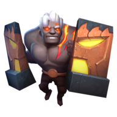

<div align="center">
  
  <h1>Auto Chess Combinator</h1>
</div>
<p align="center">
  Get information about every chess peace in Auto Chess (Epic Games) and make chess combinations as much as you want!
</p>

> **Note:**
> This is an unofficial project.
> I do not work or am I affiliated with Auto Chess, Drodo or Dragonest Co.Ltd.
> For more information about the game, visit [Auto Chess Official Website](https://ac.dragonest.com/)

## Usage

Recommended resolution for `v0.1.0`: >= 1024 x 768

Go to https://autochess-combinator.vercel.app

## Development

[](https://github.com/guastallaigor/autochess-combinator/issues)

> **Note**: Contributions are very welcomed, however is very important to open a new issue using the issue template **before** you start working on anything, so we can discuss it before hand

Fork the project and enter this commands in your terminal

```sh
$ git clone https://github.com/YOUR_GITHUB_USERNAME/autochess-combinator.git
$ cd autochess-combinator
$ yarn
$ yarn dev
```

<a href="https://www.buymeacoffee.com/guastallaigor" target="_blank"></a>

<div>
  <p>
    <a href="https://vercel.com/?utm_source=hotsapi" target="_blank" rel="noopener">
      
    </a>
  </p>
</div>

## License

GNU General Public License v3.0 © [guastallaigor](https://github.com/guastallaigor/autochess-combinator/blob/master/LICENSE) 2020
