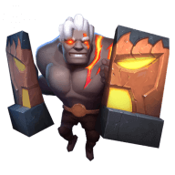

<div align="center">
  
  <h1>Auto Chess Combinator</h1>
</div>
<p align="center">
  Make chess pieces combinations as much as you want! (Auto Chess - Epic Games)
</p>

> **Note:**
> This is an unofficial project.
> I do not work or am I affiliated with Auto Chess, Drodo or Dragonest Co.Ltd.
> For more information about the game, visit [Auto Chess Official Website](https://ac.dragonest.com/).
> I've used the images from their official website, but it's a static website so no requests are being made.

## Instructions

1. Click on any card below "Chess Pieces" to select it;
2. Click on any card below "Combinator" to unselect it;
3. "Races" and "Classes" are the filters. They are toggle buttons to remove/add the cards from the grid;
4. If you make the right combinations, the buffs are shown aside the "Buffs" label;
5. Hover over any buffs to see what it does (a tooltip will appear with that information).
6. It's a PWA (Progressive Web App), you can install it if you want.

## Usage

Go to https://autochess-combinator.vercel.app

## Development

[](https://github.com/guastallaigor/autochess-combinator/issues)

> **Note**: Contributions are very welcomed, however is very important to open a new issue using the issue template **before** you start working on anything, so we can discuss it before hand

Fork the project and enter this commands in your terminal

```sh
$ git clone https://github.com/YOUR_GITHUB_USERNAME/autochess-combinator.git
$ cd autochess-combinator
$ yarn
$ yarn dev
```

<a href="https://www.buymeacoffee.com/guastallaigor" target="_blank"></a>

<div>
  <p>
    <a href="https://vercel.com/?utm_source=hotsapi" target="_blank" rel="noopener">
      
    </a>
  </p>
</div>

## License

[Apache License 2.0 © guastallaigor 2020](https://github.com/guastallaigor/autochess-combinator/blob/master/LICENSE)
